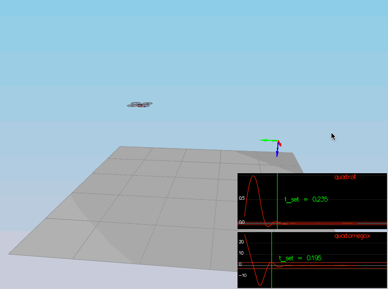
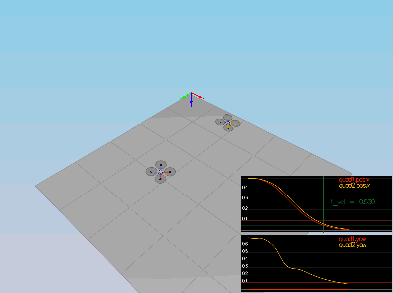
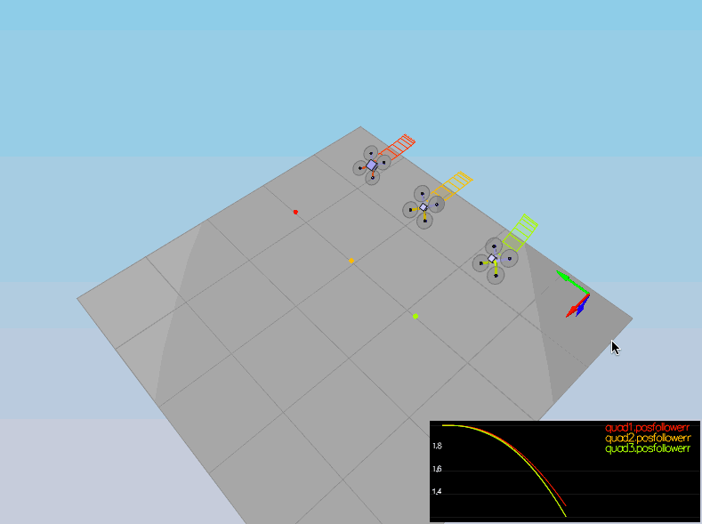

# Writeup

This is a writeup for the "Project 3: Control of a 3D Quadrotor" of the Flying Car and Autonomous Flight Engineer Nanodegree Program. It aims to communicate how I handled each implementation step for the quadrotor controller.

Apart from controller modifications, the drone mass has been changed from 0.4 to 0.5 to align with the python controller solution.

Finding PID values for the controller was a challenge by itself. I noticed that using values too high could help us resolve one set of problem. Yet, this makes other controller output less significant. It was helpful to reduce some values to find the right amount of balance. 

## Implementation steps

### Implemented body rate control in C++.

This function receives desired body rates (rad/s) and estimated body rates (rad/s)

The solution uses P controller for this module.

Our first step is to calculate the error rates on each body rate ...

```cpp
float p_error = pqrCmd.x - pqr.x;
float q_error = pqrCmd.y - pqr.y;
float r_error = pqrCmd.z - pqr.z;
```

This allows us to calculate u_bar values on each axis by multiplying values with proportional constants ...

```cpp
float u_bar_p = kpPQR.x * p_error;
float u_bar_q = kpPQR.y * q_error;
float u_bar_r = kpPQR.z * r_error;
```

Finally, multiplying u_bar values with the moments of inertia on each axis gives us the desired moments ...

```cpp
momentCmd.x = Ixx * u_bar_p;
momentCmd.y = Iyy * u_bar_q;
momentCmd.z = Izz * u_bar_r;
```

### Implement roll pitch control in C++.

This function receives desired acceleration in global coordinates, estimated attitude and desired collective thrust.

The solution uses P controller for this module.

Since we assume our propellers can not create downward thrust, first thing we do is to set pitch and roll rates to 0 for the collective thrust values smaller or equal to 0...

```cpp
if (collThrustCmd <= 0.f)
{
    pqrCmd.x = 0.f;
    pqrCmd.y = 0.f;
}
else
{
    // Rest of the code implementation will be part of this else scope.
}

```

If the collective thrust is bigger than 0, we will follow-up with the following process. Otherwise, we could safely return from the function at this point.

To calculate the roll and pitch angle rates, we start with calculating tilt angles on each x and y axis ...

```cpp
accelCmd.x / acceleration
accelCmd.y / acceleration
```

These values needs to be constraint into the drone's own capacity. i.e., 

```cpp
float b_x_cmd = -CONSTRAIN(accelCmd.x / acceleration, -maxTiltAngle, maxTiltAngle);
float b_y_cmd = -CONSTRAIN(accelCmd.y / acceleration, -maxTiltAngle, maxTiltAngle);
```

Once we have the desired tilt angle on both axis, we could calculate the error by substracting the estimated tilt angles.

```cpp
float b_x_error = b_x_cmd - b_x;
float b_y_error = b_y_cmd - b_y;
```

This leads us to calculating proportional (P) terms for each axis ...

```cpp
float b_x_p_term = kpBank * b_x_error;
float b_y_p_term = kpBank * b_y_error;
```

Once we have both P-terms, we could use the rotation matrix to get the roll and pitch rates.

```
rotation_matrix = [
  [
    rot_mat[1,0],
    -rot_mat[0,0]
  ],
  [
    rot_mat[1,1],
    -rot_mat[0,1]
  ]
] / rot_mat[2,2]
```

That gives us the following code ...

```cpp
pqrCmd.x = ((R(1, 0) * b_x_p_term) - (R(0, 0) * b_y_p_term)) / R(2, 2);
pqrCmd.y = ((R(1, 1) * b_x_p_term) - (R(0, 1) * b_y_p_term)) / R(2, 2);
```

### Implement altitude controller in C++.

The function receives following values as an input argument ...

- desired vertical position, 
- desired vertical velocity, 
- desired vertical acceleration,
- estimated position, 
- estimated velocity,
- estimated attitude
- time step for measurements

The solution uses PD controller for this module.

We start the implementation with calculating the position and velocity errors on the z-axis ...


```cpp
float z_error = posZCmd - posZ;
float z_dot_error = velZCmd - velZ;
```

We do also keep track of integral error to prevent errors that build over time ...

```cpp
integratedAltitudeError += z_error * dt;
```

Now that we obtained errors for each PID terms, we could calculate the PID terms using the constants ...

```cpp
p_term = kpPosZ * z_error;
d_term = kdPosZ * z_dot_error;
i_term = kiPosZ * integratedAltitudeError + accelZCmd;

u_bar = p_term + d_term + i_term;
```

Now that we have the u_bar, we could get the required thrust on the Z-axis by rotating the net thrust ...

```cpp
thrust = (u_bar - 9.81f) / R(2, 2);
```

Considering the limitations of the propellers, we'll need to constraint the thrust ...

```cpp
float maxAscentAcceleration = maxAscentRate / dt;
float maxDescentAcceleration = maxDescentRate / dt;

thrust = -CONSTRAIN(acceleration, -maxAscentAcceleration, maxDescentAcceleration) * mass;
```


### Implement lateral position control in C++.

The function takes following values as an input argument ...

- desired position, 
- desired velocity, 
- desired acceleration
- estimated positon,
- estimated velocity

The solution uses P controller for this module.

We start by calculating error for position and velocity.

```cpp
float x_error = posCmd.x - pos.x;
float y_error = posCmd.y - pos.y;

float x_dot_error = velCmd.x - vel.x;
float y_dot_error = velCmd.y - vel.y;
```

Finally, we calculate the acceleration on both axis by using a PD controller

```cpp
float x_dot_dot = (kpPosXY * x_error) + (kpVelXY * x_dot_error) + accelCmdFF.x;
float y_dot_dot = (kpPosXY * y_error) + (kpVelXY * y_dot_error) + accelCmdFF.y;
```

Considering the physical limitations of the propellers, we will need to scale the acceleration on each axis to the maximum allowed values (if necessary). ie.., 

```cpp
float acceleration = sqrt((x_dot_dot * x_dot_dot) + (y_dot_dot * y_dot_dot));

accelCmd.x = (acceleration > maxAccelXY) ? (x_dot_dot * maxAccelXY / acceleration) : x_dot_dot;
accelCmd.y = (acceleration > maxAccelXY) ? (y_dot_dot * maxAccelXY / acceleration) : y_dot_dot;
```


### Implement yaw control in C++.

The function receives the desired and the estimated yaw values.

The solution uses P controller for this module.

We start by calculating the error. For that, we need to ensure the desired yaw value is within [0, 2*PI] range.

```cpp
float error = fmodf(yawCmd, 2.f * F_PI) - yaw;
```

Then error rate is adjusted to allow us to rotate in opposite directions if the error exceeds the [-PI, PI] range.

```cpp
if (error > F_PI)
{
    error -= 2.f * F_PI;
}
else if (error < -F_PI)
{
    error += 2.f * F_PI;
}
```

Finally, we calculate the yaw rate using the P controller constant ...
```cpp
yawRateCmd = error * kpYaw;
```


### Implement calculating the motor commands given commanded thrust and moments in C++.

The function receives collective thrust (N) and rotation moments on each axis (Nm).

Our first step is to convert rotation moments into thrust ...

```cpp
// `l` is the propeller distance to x and y axis
float l = L / sqrt(2.f);

float p_bar = momentCmd.x / l;
float q_bar = momentCmd.y / l;
float r_bar = momentCmd.z / kappa;
```

Once we have the collective thrust and desired thrust on each axis, we could deduct each propeller thrust via a combination of adding and/or subtracting. i.e., 

```cpp
float omega_1_square = (c_bar + p_bar + q_bar - r_bar) * 0.25f;
float omega_2_square = (c_bar - p_bar + q_bar + r_bar) * 0.25f;
float omega_3_square = (c_bar - p_bar - q_bar - r_bar) * 0.25f;
float omega_4_square = (c_bar + p_bar - q_bar + r_bar) * 0.25f;
```

Finally, each propeller thrust needs to be constraint into given min and max motor thrust limitations.

```cpp
cmd.desiredThrustsN[0] = CONSTRAIN(omega_1_square, minMotorThrust, maxMotorThrust); // front left
cmd.desiredThrustsN[1] = CONSTRAIN(omega_2_square, minMotorThrust, maxMotorThrust); // front right
cmd.desiredThrustsN[2] = CONSTRAIN(omega_4_square, minMotorThrust, maxMotorThrust); // rear left
cmd.desiredThrustsN[3] = CONSTRAIN(omega_3_square, minMotorThrust, maxMotorThrust); // rear right
```

While working on calculating the motor commands, I made the mistake of assigning rear left and rear right propeller in the reverse order. This caused an issue for the other steps and took a long time to notice.

## Scenarios

## Scenario 1

<p align="center">

</p>

## Scenario 2

<p align="center">

</p>

## Scenario 3

<p align="center">

</p>

## Scenario 4

<p align="center">

</p>

## Scenario 5

<p align="center">

</p>
